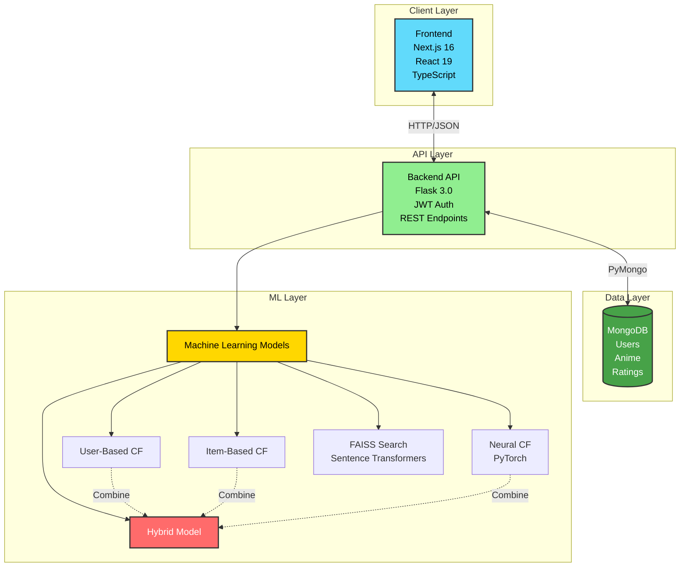

# Anime Recommendation System

A full-stack anime recommendation system that combines multiple machine learning approaches to provide personalized anime recommendations. The system implements collaborative filtering (user-based, item-based, neural collaborative filtering), hybrid models, and semantic search using FAISS vector indexing.

## Table of Contents

-   [Overview](#overview)
-   [Features](#features)
-   [System Architecture](#system-architecture)
-   [Technology Stack](#technology-stack)
-   [Project Structure](#project-structure)
-   [Getting Started](#getting-started)
-   [API Documentation](#api-documentation)
-   [Machine Learning Models](#machine-learning-models)
-   [Development](#development)
-   [License](#license)

## Overview

This recommendation system leverages advanced machine learning techniques to deliver accurate and personalized anime recommendations. It processes user ratings, analyzes anime metadata, and employs multiple recommendation strategies to ensure high-quality suggestions.

### Key Capabilities

-   **Personalized Recommendations**: User-based and item-based collaborative filtering
-   **Neural Network Predictions**: Deep learning model for rating prediction
-   **Semantic Search**: FAISS-powered vector search for content-based discovery
-   **Hybrid Approach**: Weighted combination of multiple models for optimal results
-   **Real-time Updates**: Dynamic model retraining and index rebuilding
-   **User Management**: Authentication, profile management, and rating history

## Features

### User Features

-   User authentication and authorization (JWT-based)
-   Browse anime catalog with detailed information
-   Rate anime on a scale of 1-10
-   Get personalized recommendations based on rating history
-   Semantic search to discover anime by description
-   View and manage rating history
-   Profile management

### Admin Features

-   Model training and retraining interface
-   Performance metrics and visualization
-   System monitoring and analytics
-   Data import and management

### Recommendation Engines

1. **User-Based Collaborative Filtering**: Recommends anime based on similar users' preferences
2. **Item-Based Collaborative Filtering**: Suggests anime similar to those the user has rated highly
3. **Neural Collaborative Filtering (NCF)**: Deep learning model for accurate rating predictions
4. **Hybrid Model**: Weighted combination of multiple approaches
5. **FAISS Semantic Search**: Vector-based similarity search for content discovery

## System Architecture



### Components

-   **Frontend**: Next.js 16 with TypeScript, React 19, and Tailwind CSS
-   **Backend**: Flask REST API with JWT authentication
-   **Database**: MongoDB for user data, ratings, and anime metadata
-   **ML Pipeline**: Scikit-learn, PyTorch, FAISS for recommendations
-   **Vector Search**: Sentence Transformers with FAISS indexing

## Technology Stack

### Frontend

-   **Framework**: Next.js 16.0.7
-   **Language**: TypeScript 5
-   **UI Library**: React 19.2.0
-   **Styling**: Tailwind CSS 4.1.9
-   **Components**: Radix UI, shadcn/ui
-   **State Management**: React Context API
-   **Charts**: Recharts
-   **Forms**: React Hook Form with Zod validation

### Backend

-   **Framework**: Flask 3.0.0
-   **Language**: Python 3.x
-   **Database**: MongoDB (PyMongo 4.6.0)
-   **Authentication**: Flask-JWT-Extended 4.6.0
-   **ML Libraries**:
    -   scikit-learn 1.7.2
    -   scikit-surprise 1.1.4
    -   PyTorch 2.0.1
    -   FAISS-CPU 1.7.4
    -   Sentence Transformers 2.2.2
-   **Data Processing**: Pandas 2.3.3, NumPy 1.26.2
-   **Visualization**: Matplotlib 3.8.2, Seaborn 0.13.0

## Project Structure

```
Recommendation_system/
├── backend/                    # Flask backend application
│   ├── app/                    # Application package
│   │   ├── routes/             # API endpoints
│   │   ├── services/           # Business logic
│   │   └── config.py           # Configuration
│   ├── ml/                     # Machine learning modules
│   │   ├── models/             # ML model implementations
│   │   ├── services/           # ML services (FAISS, embeddings)
│   │   ├── training/           # Training scripts
│   │   └── saved_models/       # Trained model files
│   ├── scripts/                # Utility scripts
│   └── run.py                  # Application entry point
├── frontend/                   # Next.js frontend application
│   ├── app/                    # App router pages
│   ├── components/             # React components
│   ├── lib/                    # Utilities and API client
│   ├── context/                # React context providers
│   └── types/                  # TypeScript type definitions
├── requirements.txt            # Python dependencies
└── README.md                   # This file
```

## Getting Started

### Prerequisites

-   Python 3.8+
-   Node.js 18+
-   MongoDB 4.4+
-   pnpm (recommended) or npm

### Installation

1. **Clone the repository**

```bash
git clone https://github.com/PhucHuwu/Recommendation_system.git
cd Recommendation_system
```

2. **Set up Backend**

```bash
cd backend
pip install -r ../requirements.txt
```

Create a `.env` file in the backend directory:

```env
FLASK_ENV=development
SECRET_KEY=your-secret-key
JWT_SECRET_KEY=your-jwt-secret
MONGODB_URI=mongodb://localhost:27017/
MONGODB_DB=anime_recommendation
```

3. **Set up Frontend**

```bash
cd frontend
pnpm install
```

Create a `.env.local` file in the frontend directory:

```env
NEXT_PUBLIC_API_URL=http://localhost:5000/api
```

4. **Initialize Database**

```bash
cd backend
python scripts/import_data.py
python scripts/build_faiss_index.py
```

### Running the Application

1. **Start MongoDB**

```bash
mongod
```

2. **Start Backend Server**

```bash
cd backend
python run.py
# Server runs on http://localhost:5000
```

3. **Start Frontend Development Server**

```bash
cd frontend
pnpm dev
# Application runs on http://localhost:3000
```

## API Documentation

### Authentication

-   `POST /api/auth/register` - Register new user
-   `POST /api/auth/login` - Login user
-   `GET /api/auth/profile` - Get user profile (requires auth)

### Anime

-   `GET /api/anime` - Get anime list (paginated)
-   `GET /api/anime/:id` - Get anime details
-   `GET /api/anime/search` - Search anime

### Recommendations

-   `GET /api/recommendations/:user_id` - Get personalized recommendations
-   `GET /api/recommendations/:user_id/similar/:anime_id` - Get similar anime

### Ratings

-   `POST /api/ratings` - Submit rating (requires auth)
-   `GET /api/ratings/user/:user_id` - Get user ratings
-   `DELETE /api/ratings/:rating_id` - Delete rating (requires auth)

### Admin

-   `POST /api/admin/train` - Train models (requires admin auth)
-   `GET /api/admin/metrics` - Get model performance metrics

For detailed API documentation, see [backend/README_BE.md](backend/README_BE.md).

## Machine Learning Models

### 1. User-Based Collaborative Filtering

Finds users with similar rating patterns and recommends anime they enjoyed.

-   **Similarity Metric**: Pearson correlation
-   **K-Nearest Neighbors**: Configurable number of similar users
-   **Use Case**: Cold-start for items, personalized discovery

### 2. Item-Based Collaborative Filtering

Recommends anime similar to those the user has rated highly.

-   **Similarity Metric**: Adjusted cosine similarity
-   **Use Case**: Consistent recommendations based on item relationships

### 3. Neural Collaborative Filtering (NCF)

Deep learning model that learns latent user and item representations.

-   **Architecture**: Multi-layer perceptron with embedding layers
-   **Training**: PyTorch with Adam optimizer
-   **Use Case**: Accurate rating predictions

### 4. Hybrid Weighted Model

Combines multiple models using weighted averaging.

-   **Strategy**: Configurable weights for each base model
-   **Fallback**: Graceful degradation when models can't predict
-   **Use Case**: Best overall performance

### 5. FAISS Semantic Search

Vector-based similarity search for content discovery.

-   **Embeddings**: Sentence Transformers (paraphrase-multilingual-MiniLM-L12-v2)
-   **Index**: FAISS for efficient similarity search
-   **Use Case**: Find anime by description, theme, or plot

### Model Performance

Models are evaluated using:

-   **RMSE**: Root Mean Squared Error
-   **MAE**: Mean Absolute Error
-   **Precision@K**: Precision at top K recommendations
-   **Recall@K**: Recall at top K recommendations
-   **Coverage**: Percentage of catalog that can be recommended

## Development

### Backend Development

See [backend/README_BE.md](backend/README_BE.md) for:

-   Project structure details
-   API endpoint documentation
-   Model training procedures
-   Testing guidelines

### Frontend Development

See [frontend/README_FE.md](frontend/README_FE.md) for:

-   Component architecture
-   Styling conventions
-   State management patterns
-   Build and deployment

### Code Style

-   **Python**: Follow PEP 8 guidelines
-   **TypeScript**: ESLint configuration included
-   **Commits**: Use conventional commit messages

### Testing

```bash
# Backend tests
cd backend
pytest

# Frontend tests
cd frontend
pnpm test
```

## License

This project is licensed under the MIT License - see the [LICENSE](LICENSE) file for details.

## Acknowledgments

-   Anime dataset from Kaggle
-   Built with Flask, Next.js, and PyTorch
-   UI components from shadcn/ui
-   Vector search powered by FAISS

---

For detailed component documentation:

-   [Backend Documentation](backend/README_BE.md)
-   [Frontend Documentation](frontend/README_FE.md)
