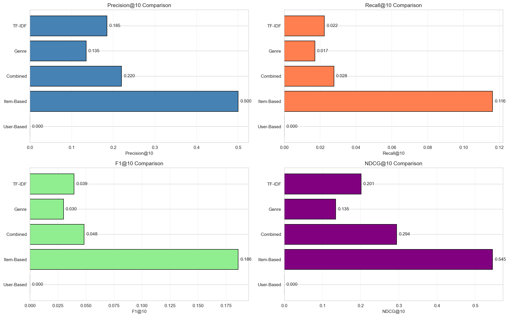
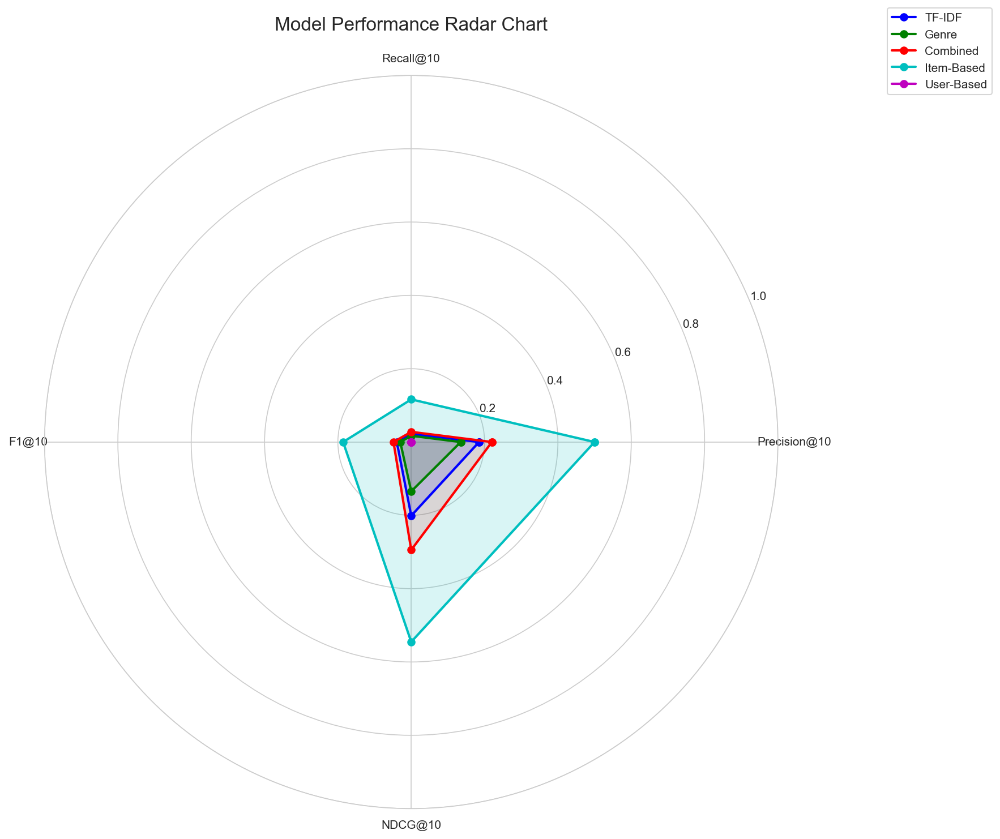

# Movie Recommendation System

A comprehensive recommendation system built using Content-Based Filtering and Collaborative Filtering techniques on the MovieLens dataset.

## Table of Contents

-   [Overview](#overview)
-   [Features](#features)
-   [Project Structure](#project-structure)
-   [Installation](#installation)
-   [Usage](#usage)
-   [Models & Evaluation](#models--evaluation)
-   [Tech Stack](#tech-stack)
-   [Results](#results)
-   [Documentation](#documentation)
-   [License](#license)

## Overview

This project implements an end-to-end movie recommendation system that combines multiple recommendation approaches to provide diverse and accurate movie suggestions. The system includes data collection, preprocessing, exploratory data analysis, model training, evaluation, and a web-based user interface.

### Key Highlights

-   **Dataset**: 9,742 movies with 100,836 ratings from 610 users
-   **Features**: 28 engineered features including genres, ratings, temporal data, and TF-IDF vectors
-   **Models**: 5 trained recommendation models using different approaches
-   **Web Interface**: Interactive Streamlit application for real-time recommendations
-   **Evaluation**: Comprehensive metrics including Precision@K, Recall@K, F1@K, and NDCG@K

## Features

### Core Functionality

-   **Data Collection & Processing**

    -   Automated MovieLens dataset download and extraction
    -   Comprehensive data cleaning (missing values, duplicates, outliers)
    -   Advanced feature engineering (23+ features)
    -   Text vectorization (TF-IDF, Bag-of-Words)

-   **Exploratory Data Analysis**

    -   20+ visualizations including distribution plots, heatmaps, and word clouds
    -   Genre and temporal trend analysis
    -   Correlation analysis between features
    -   Interactive insights into rating patterns

-   **Recommendation Models**

    -   Content-Based Filtering (3 variants)
        -   TF-IDF based similarity
        -   Genre-based matching
        -   Combined features approach
    -   Collaborative Filtering (2 variants)
        -   Item-based recommendations
        -   User-based personalization

-   **Model Evaluation**

    -   Multiple ranking metrics (Precision@K, Recall@K, F1@K, NDCG@K)
    -   Rating prediction metrics (RMSE, MAE)
    -   Coverage and diversity metrics
    -   Visual comparison tools

-   **Web Application**
    -   Search and browse movies
    -   Get recommendations from multiple models
    -   Personalized user recommendations
    -   Side-by-side model comparison
    -   Modern, responsive UI

## Project Structure

```
Recommendation_system/
├── data/
│   ├── raw/                        # Original MovieLens dataset
│   ├── processed/                  # Processed data and features
│   └── models/                     # Trained model files (~2.3GB)
├── notebooks/
│   ├── 01_data_collection.ipynb    # Data acquisition and initial exploration
│   ├── 02_data_cleaning.ipynb      # Data cleaning and preprocessing
│   ├── 03_eda_visualization.ipynb  # Exploratory data analysis
│   ├── 04_model_building.ipynb     # Model training and comparison
│   └── 05_model_evaluation.ipynb   # Performance evaluation
├── src/
│   ├── data_processing/
│   │   ├── collector.py            # Data collection utilities
│   │   ├── cleaner.py              # Data cleaning methods
│   │   └── preprocessor.py         # Feature engineering
│   ├── models/
│   │   ├── content_based.py        # Content-based recommender
│   │   └── collaborative_filtering.py  # Collaborative filtering
│   └── evaluation/
│       └── metrics.py              # Evaluation metrics
├── web_app/
│   ├── app.py                      # Streamlit web application
│   ├── requirements.txt            # Web app dependencies
│   └── README.md                   # Web app documentation
├── reports/                        # Evaluation results and visualizations
├── tests/                          # Unit tests
└── requirements.txt                # Project dependencies
```

## Installation

### Prerequisites

-   Python 3.8 or higher
-   pip package manager
-   4GB RAM minimum (for loading all models)
-   3GB free disk space

### Setup Instructions

1. **Clone the repository**

    ```bash
    git clone <repository-url>
    cd Recommendation_system
    ```

2. **Create virtual environment** (recommended)

    ```bash
    python -m venv venv
    source venv/bin/activate  # On Windows: venv\Scripts\activate
    ```

3. **Install dependencies**

    ```bash
    pip install -r requirements.txt
    ```

4. **Download dataset** (if not already present)
    ```bash
    python src/data_processing/collector.py
    ```

## Usage

### Running Notebooks

Execute the notebooks in sequence to reproduce the entire pipeline:

```bash
# 1. Data Collection
jupyter notebook notebooks/01_data_collection.ipynb

# 2. Data Cleaning and Preprocessing
jupyter notebook notebooks/02_data_cleaning.ipynb

# 3. Exploratory Data Analysis
jupyter notebook notebooks/03_eda_visualization.ipynb

# 4. Model Building
jupyter notebook notebooks/04_model_building.ipynb

# 5. Model Evaluation
jupyter notebook notebooks/05_model_evaluation.ipynb
```

### Running the Web Application

Launch the Streamlit web interface:

```bash
streamlit run web_app/app.py
```

The application will open in your browser at `http://localhost:8501`

#### Web App Features

-   **Search & Recommend**: Find movies and get similar recommendations
-   **User Recommendations**: Personalized suggestions based on user history
-   **Model Comparison**: Compare recommendations from different models side-by-side

### Using Models Programmatically

```python
from src.models.content_based import ContentBasedRecommender
from src.models.collaborative_filtering import CollaborativeFilteringRecommender

# Load Content-Based model
cb_model = ContentBasedRecommender(verbose=False)
cb_model.load_model(
    'data/models/content_based_combined.pkl',
    'data/processed/movies_enriched.csv'
)

# Get recommendations
recommendations = cb_model.get_recommendations_by_title("Toy Story", n=10)
print(recommendations)

# Load Collaborative Filtering model
cf_model = CollaborativeFilteringRecommender(approach='item', verbose=False)
cf_model.load_model(
    'data/models/collaborative_item_based.pkl',
    'data/processed/ratings.csv',
    'data/processed/movies_enriched.csv'
)

# Get item-based recommendations
recommendations = cf_model.get_item_based_recommendations(movie_id=1, n=10)
print(recommendations)
```

## Models & Evaluation

### Recommendation Models

The system implements five distinct recommendation models:

1. **Content-Based TF-IDF**

    - Uses TF-IDF vectorization of movie genres and titles
    - 200-dimensional feature space
    - Fast similarity computation using cosine similarity

2. **Content-Based Genre**

    - Binary genre indicators (10 genres)
    - Pure genre-based matching
    - Effective for finding movies in same categories

3. **Content-Based Combined**

    - Combines genre features with numeric metadata
    - Includes year, ratings, popularity, and movie age
    - Weighted feature combination (genre weight: 2.0, numeric weight: 1.0)

4. **Collaborative Filtering (Item-Based)**

    - Item-item similarity from user rating patterns
    - Matrix: 606 users × 450 movies
    - Sparsity: 84.83%

5. **Collaborative Filtering (User-Based)**
    - User-user similarity for personalization
    - Predicts ratings based on similar users
    - Best for established users with rating history

### Evaluation Results

#### Performance Metrics

All models were evaluated using ranking metrics at K=10:

| Model                          | Precision@10 | Recall@10  | F1@10      | NDCG@10    |
| ------------------------------ | ------------ | ---------- | ---------- | ---------- |
| Content-Based (TF-IDF)         | 0.1850       | 0.0224     | 0.0393     | 0.2011     |
| Content-Based (Genre)          | 0.1350       | 0.0171     | 0.0299     | 0.1346     |
| Content-Based (Combined)       | 0.2200       | 0.0277     | 0.0484     | 0.2944     |
| **Collaborative (Item-Based)** | **0.5000**   | **0.1163** | **0.1858** | **0.5452** |
| Collaborative (User-Based)     | 0.0000       | 0.0000     | 0.0000     | 0.0000     |

**Best Overall Model**: Collaborative Filtering (Item-Based)

#### Visual Comparison

**Performance Across All Metrics**



**Radar Chart - Overall Performance**



### Key Insights

-   **Item-Based Collaborative Filtering** significantly outperforms content-based approaches across all metrics
-   **Combined Features** content-based model performs best among content-based variants
-   User-Based CF shows zero performance due to limited test data overlap
-   Content-based models provide consistent, explainable recommendations
-   Collaborative filtering excels at discovering unexpected but relevant recommendations

## Tech Stack

### Core Libraries

-   **Data Processing**: pandas 2.0+, numpy 1.24+
-   **Machine Learning**: scikit-learn 1.3+
-   **Visualization**: matplotlib 3.7+, seaborn 0.12+, wordcloud
-   **Web Framework**: Streamlit 1.28+

### Development Tools

-   **Notebooks**: Jupyter Notebook
-   **Version Control**: Git
-   **Package Management**: pip
-   **Virtual Environment**: venv

### Algorithms & Techniques

-   **Feature Engineering**: TF-IDF, One-Hot Encoding, Normalization
-   **Similarity Metrics**: Cosine Similarity
-   **Recommendation**: Content-Based Filtering, Collaborative Filtering
-   **Evaluation**: Precision@K, Recall@K, F1-Score, NDCG

## Results

### Dataset Statistics

-   **Movies**: 9,742
-   **Ratings**: 100,836
-   **Users**: 610
-   **Genres**: 20 unique categories
-   **Year Range**: 1902 - 2018
-   **Average Rating**: 3.50 / 5.0

### Model Performance Summary

-   **Best Precision**: Item-Based CF (0.5000)
-   **Best Recall**: Item-Based CF (0.1163)
-   **Best NDCG**: Item-Based CF (0.5452)
-   **Fastest**: Content-Based models (~0.1s per query)
-   **Most Accurate**: Item-Based Collaborative Filtering

### Feature Engineering

-   **Original Features**: 5 (title, genres, rating, year, tags)
-   **Engineered Features**: 23+
    -   Genre indicators (10)
    -   Rating statistics (5)
    -   Temporal features (3)
    -   Text vectors (200)
    -   Combined features (15)

## Documentation

### Project Reports

-   `reports/requirements_compliance.md` - Requirements checklist and compliance
-   `reports/phase4_model_summary.md` - Detailed model specifications
-   `reports/progress_report.md` - Development progress tracking
-   `reports/evaluation_summary.txt` - Model evaluation summary
-   `reports/model_evaluation_results.csv` - Detailed performance metrics

### Notebooks Documentation

Each notebook includes:

-   Clear section headers and markdown explanations
-   Code comments and docstrings
-   Visualization outputs
-   Summary insights and conclusions

### API Documentation

All modules include comprehensive docstrings following Google style:

```python
def get_recommendations(self, movie_id: int, n: int = 10) -> pd.DataFrame:
    """
    Get top N recommendations for a movie.

    Args:
        movie_id: MovieLens movie ID
        n: Number of recommendations to return

    Returns:
        DataFrame with recommended movies and similarity scores
    """
```

## Contributing

This project was developed as part of a final project for a Recommendation Systems course.

### Development Team

[Add team member information here]

### Course Information

-   **Course**: Recommendation Systems
-   **Institution**: [Institution Name]
-   **Year**: 2025

## References

-   **Dataset**: [MovieLens](https://grouplens.org/datasets/movielens/) - F. Maxwell Harper and Joseph A. Konstan. 2015.
-   **Algorithms**: Based on classic recommendation system techniques
-   **Libraries**: scikit-learn, pandas, Streamlit documentation

## License

This project is licensed under the MIT License - see the LICENSE file for details.

---

**Project Status**: Complete and Production-Ready  
**Last Updated**: December 2025  
**Version**: 1.0.0
