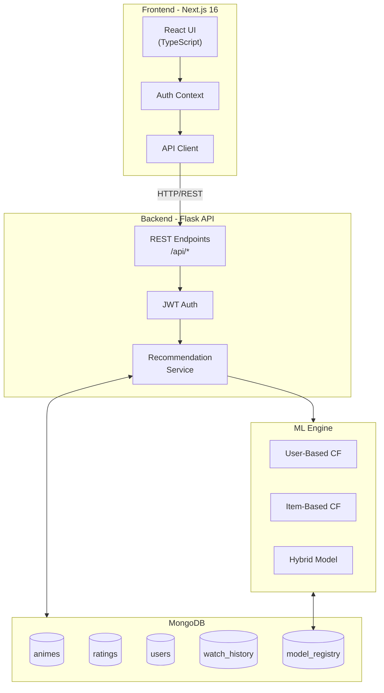

# WibiFlix - Anime Recommendation System

A full-stack anime recommendation system powered by collaborative filtering machine learning algorithms. The system provides personalized anime suggestions based on user ratings and viewing patterns.

## Table of Contents

-   [Project Overview](#project-overview)
-   [System Architecture](#system-architecture)
-   [Features](#features)
-   [Technology Stack](#technology-stack)
-   [Machine Learning Approach](#machine-learning-approach)
-   [Quick Start](#quick-start)
-   [Project Structure](#project-structure)
-   [API Reference](#api-reference)
-   [Database Schema](#database-schema)
-   [Model Performance](#model-performance)
-   [Screenshots](#screenshots)
-   [Contributing](#contributing)
-   [License](#license)

## Project Overview

WibiFlix is an intelligent anime recommendation platform that leverages collaborative filtering techniques to deliver personalized content suggestions. The system analyzes user rating patterns and item similarities to predict preferences and recommend relevant anime titles.

### Key Highlights

-   Personalized recommendations using User-Based, Item-Based, and Hybrid Collaborative Filtering
-   Real-time model switching and comparison
-   Comprehensive evaluation metrics (RMSE, Precision@K, Recall@K, Coverage, Diversity, Novelty)
-   Modern, responsive web interface
-   Admin dashboard for system monitoring and model management

## System Architecture



### Component Interaction Flow

1. **User Request**: Frontend sends HTTP requests to Flask API
2. **Authentication**: JWT-based token authentication
3. **Recommendation**: Backend loads trained ML model, generates predictions
4. **Data Storage**: MongoDB stores users, animes, ratings, and model registry
5. **Response**: API returns JSON data to frontend for rendering

## Features

### For Users

| Feature                      | Description                                            |
| ---------------------------- | ------------------------------------------------------ |
| Personalized Recommendations | AI-generated anime suggestions based on rating history |
| Anime Discovery              | Browse, search, and filter anime catalog               |
| Rating System                | Rate animes on a 1-10 scale to improve recommendations |
| Watch History                | Track and manage viewed anime titles                   |
| Similar Anime                | Find animes similar to ones you enjoyed                |
| User Profile                 | View personal statistics and preferences               |

### For Administrators

| Feature             | Description                                                     |
| ------------------- | --------------------------------------------------------------- |
| System Dashboard    | Overview of users, animes, ratings, and engagement              |
| Model Management    | View, compare, and switch between ML models                     |
| Performance Metrics | Monitor model accuracy (RMSE, MAE, Precision, Recall)           |
| Data Visualization  | Charts for rating distribution, genre analysis, user engagement |

## Technology Stack

### Backend

| Component       | Technology                                |
| --------------- | ----------------------------------------- |
| Web Framework   | Flask 3.0.0                               |
| Database        | MongoDB with PyMongo 4.6.0                |
| Authentication  | Flask-JWT-Extended 4.6.0                  |
| ML Libraries    | scikit-learn 1.7.2, scikit-surprise 1.1.4 |
| Data Processing | Pandas 2.3.3, NumPy 1.26.2, SciPy 1.11.4  |
| NLP             | NLTK 3.8.1                                |

### Frontend

| Component        | Technology          |
| ---------------- | ------------------- |
| Framework        | Next.js 16.0.7      |
| Language         | TypeScript 5.x      |
| UI Library       | React 19.2.0        |
| Styling          | Tailwind CSS 4.1.9  |
| UI Components    | Radix UI Primitives |
| Charts           | Recharts            |
| State Management | React Context       |

### Infrastructure

| Component            | Technology   |
| -------------------- | ------------ |
| Database             | MongoDB 6.0+ |
| Package Manager (FE) | pnpm         |
| Package Manager (BE) | pip/conda    |

## Machine Learning Approach

### Collaborative Filtering Models

#### 1. User-Based Collaborative Filtering

Recommends items based on the preferences of similar users.

**Algorithm:**

1. Build user-item rating matrix
2. Compute user-user similarity (cosine/Pearson)
3. For target user, find K nearest neighbors
4. Predict rating as weighted average of neighbor ratings

**Parameters:**

-   `k_neighbors`: 50
-   `similarity`: cosine
-   `min_overlap`: 3 co-rated items

#### 2. Item-Based Collaborative Filtering

Recommends items similar to those the user has rated highly.

**Algorithm:**

1. Build user-item rating matrix
2. Compute item-item similarity (adjusted cosine)
3. For prediction, use user's ratings for similar items
4. Calculate weighted average by similarity scores

**Parameters:**

-   `k_similar`: 30
-   `similarity`: adjusted_cosine
-   `min_ratings`: 10

#### 3. Hybrid Weighted Model

Combines both approaches for improved performance.

**Algorithm:**

```
prediction = alpha * user_based_pred + beta * item_based_pred
```

-   Automatic fallback when one model cannot predict
-   Weights optimized via grid search on validation set

### Evaluation Metrics

| Metric      | Type     | Description                                   |
| ----------- | -------- | --------------------------------------------- |
| RMSE        | Accuracy | Root Mean Square Error (lower is better)      |
| MAE         | Accuracy | Mean Absolute Error (lower is better)         |
| Precision@K | Ranking  | Relevant items in top-K (higher is better)    |
| Recall@K    | Ranking  | Coverage of relevant items (higher is better) |
| Coverage    | Catalog  | Percentage of items recommended               |
| Diversity   | Quality  | Variety in recommendations                    |
| Novelty     | Quality  | Non-obviousness of suggestions                |

### Data Split Strategy

Stratified user-based splitting (80% train, 20% test):

-   Preserves user rating patterns
-   All test users have ratings in training set
-   Fair evaluation across user segments

## Quick Start

### Prerequisites

-   Python 3.10+
-   Node.js 18.17+
-   MongoDB 6.0+
-   pnpm (recommended for frontend)

### 1. Clone Repository

```bash
git clone https://github.com/PhucHuwu/Recommendation_system.git
cd Recommendation_system
```

### 2. Backend Setup

```bash
# Create virtual environment
conda create -n RCMsys python=3.10
conda activate RCMsys

# Install dependencies
pip install -r requirements.txt

# Configure environment
cd backend
cp .env.example .env
# Edit .env with your MongoDB connection string

# Import data (requires Kaggle API key)
python scripts/import_data.py

# Train models
python -m ml.training.train

# Start backend server
python run.py
```

Backend will run at: `http://localhost:5000`

### 3. Frontend Setup

```bash
cd frontend

# Install dependencies
pnpm install

# Configure environment
cp .env.example .env.local
# Set NEXT_PUBLIC_API_URL=http://localhost:5000/api

# Start development server
pnpm dev
```

Frontend will run at: `http://localhost:3000`

### 4. Access Application

-   **Main Application**: http://localhost:3000
-   **Admin Panel**: http://localhost:3000/admin (requires admin login)
-   **API Health Check**: http://localhost:5000/health

## Project Structure

```
Recommendation_system/
├── README.md                   # This file
├── README_BE.md                # Backend documentation
├── README_FE.md                # Frontend documentation
├── requirements.txt            # Python dependencies
├── anime_recommendation_demo.ipynb  # Jupyter notebook demo
│
├── backend/                    # Flask API Server
│   ├── run.py                  # Entry point
│   ├── app/                    # Application package
│   │   ├── __init__.py         # App factory
│   │   ├── config.py           # Configuration
│   │   ├── routes/             # API endpoints
│   │   ├── services/           # Business logic
│   │   └── utils/              # Utilities
│   ├── ml/                     # Machine Learning
│   │   ├── models/             # CF model implementations
│   │   ├── training/           # Training pipeline
│   │   └── saved_models/       # Trained model files
│   └── scripts/                # Utility scripts
│
└── frontend/                   # Next.js Application
    ├── app/                    # App Router pages
    ├── components/             # React components
    ├── context/                # Context providers
    ├── hooks/                  # Custom hooks
    ├── lib/                    # Utilities
    ├── types/                  # TypeScript types
    └── public/                 # Static assets
```

## API Reference

### Authentication

```bash
# Login
POST /api/auth/login
Body: { "user_id": 1 }
Response: { "token": "jwt-token", "user": { "user_id": 1 } }
```

### Recommendations

```bash
# Get personalized recommendations
GET /api/recommendation?limit=10&model=hybrid
Headers: Authorization: Bearer <token>
Response: {
  "recommendations": [...],
  "model_used": "hybrid",
  "count": 10
}

# Get similar animes
GET /api/recommendation/similar/1?limit=5
Response: {
  "anime_id": 1,
  "similar_animes": [...],
  "method": "item-based"
}
```

### Animes

```bash
# List animes
GET /api/anime?page=1&limit=20&genre=Action&sort=score

# Get anime details
GET /api/anime/1

# Search animes
GET /api/anime/search?q=naruto&limit=10

# Get top animes
GET /api/anime/top?limit=10
```

### Ratings

```bash
# Add rating
POST /api/rating
Headers: Authorization: Bearer <token>
Body: { "anime_id": 1, "rating": 8 }

# Update rating
PUT /api/rating/1
Body: { "rating": 9 }

# Delete rating
DELETE /api/rating/1
```

For complete API documentation, see [README_BE.md](./README_BE.md).

## Database Schema

### Collections

| Collection     | Description                                     |
| -------------- | ----------------------------------------------- |
| animes         | Anime metadata (title, score, genres, synopsis) |
| ratings        | User-anime ratings (1-10 scale)                 |
| users          | User accounts and login history                 |
| watch_history  | User viewing history                            |
| model_registry | ML model metadata and metrics                   |

### Key Indexes

-   `animes.mal_id` (unique)
-   `ratings.user_id`
-   `ratings.anime_id`
-   `ratings.(user_id, anime_id)` (compound, unique)

## Model Performance

Performance metrics from the trained models (results may vary):

| Model         | RMSE | MAE  | Precision@10 | Recall@10 | Coverage |
| ------------- | ---- | ---- | ------------ | --------- | -------- |
| User-Based CF | ~1.2 | ~0.9 | ~15%         | ~5%       | ~30%     |
| Item-Based CF | ~1.1 | ~0.8 | ~18%         | ~6%       | ~25%     |
| Hybrid        | ~1.0 | ~0.8 | ~20%         | ~7%       | ~35%     |

Note: Actual metrics depend on dataset size and training parameters.

## Screenshots

### Homepage

-   Hero section with personalized recommendations
-   Top anime carousel
-   Quick access to search and browse

### Anime Detail Page

-   Full anime information and synopsis
-   User rating interface
-   Similar anime recommendations

### Admin Dashboard

-   System statistics overview
-   Rating distribution charts
-   Model performance comparison

### Model Management

-   View all trained models
-   Compare evaluation metrics
-   Activate preferred model

## Environment Variables

### Backend (.env)

```env
FLASK_ENV=development
SECRET_KEY=your-secret-key
MONGODB_URI=mongodb://localhost:27017/
MONGODB_DB=anime_recommendation
JWT_SECRET_KEY=your-jwt-secret
JWT_ACCESS_TOKEN_EXPIRES=86400
API_PREFIX=/api
```

### Frontend (.env.local)

```env
NEXT_PUBLIC_API_URL=http://localhost:5000/api
```

## Data Source

The system uses the Anime Recommendation Database 2020 from Kaggle:

-   **Dataset**: `hernan4444/anime-recommendation-database-2020`
-   **Source**: MyAnimeList (MAL)
-   **Size**: ~17,000 animes, 3 million ratings (limited)
-   **Files Used**:
    -   `anime_with_synopsis.csv` - Anime metadata
    -   `rating_complete.csv` - User ratings

## Contributing

1. Fork the repository
2. Create a feature branch (`git checkout -b feature/new-feature`)
3. Commit changes (`git commit -am 'Add new feature'`)
4. Push to branch (`git push origin feature/new-feature`)
5. Create Pull Request

### Development Guidelines

-   Follow PEP 8 for Python code
-   Use ESLint/Prettier for TypeScript
-   Write meaningful commit messages
-   Add tests for new features
-   Update documentation as needed

## Troubleshooting

### Common Issues

**MongoDB Connection Error**

```
Could not connect to MongoDB
```

Solution: Ensure MongoDB is running on localhost:27017

**Model Not Found**

```
Model file not found: user_based_cf.pkl
```

Solution: Run training pipeline first: `python -m ml.training.train`

**CORS Error**

```
Access-Control-Allow-Origin header missing
```

Solution: Backend is configured for all origins in development. Check Flask-CORS setup.

**JWT Token Expired**

```
Token has expired
```

Solution: Re-login to get a new token. Default expiry is 24 hours.

## Future Improvements

-   Content-based filtering using anime synopsis (NLP)
-   Deep learning models (Neural Collaborative Filtering)
-   Real-time model retraining
-   A/B testing framework
-   User registration with password authentication
-   Social features (reviews, lists, friends)

## License

This project is part of an academic recommendation system implementation for educational purposes.

## Authors

-   PhucHuwu - [GitHub](https://github.com/PhucHuwu)

## Acknowledgments

-   Kaggle for the anime dataset
-   MyAnimeList for the original data
-   Flask and Next.js communities for excellent documentation
