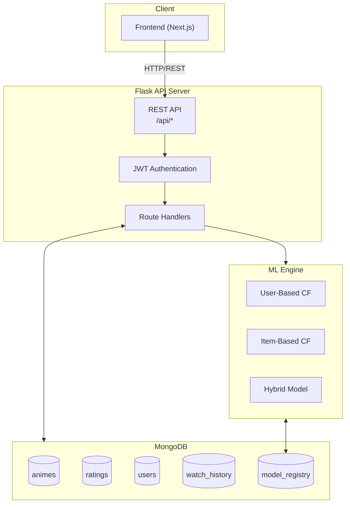

# Anime Recommendation System - Backend

## Overview

The backend is a RESTful API service built with Flask, providing personalized anime recommendations using collaborative filtering machine learning models. It connects to MongoDB for data storage and serves the frontend application with recommendation endpoints.

## Table of Contents

-   [Technology Stack](#technology-stack)
-   [Architecture](#architecture)
-   [Project Structure](#project-structure)
-   [Machine Learning Models](#machine-learning-models)
-   [API Documentation](#api-documentation)
-   [Database Schema](#database-schema)
-   [Installation](#installation)
-   [Configuration](#configuration)
-   [Running the Application](#running-the-application)
-   [Model Training](#model-training)
-   [Testing](#testing)

## Technology Stack

| Category         | Technology                    | Version       |
| ---------------- | ----------------------------- | ------------- |
| Framework        | Flask                         | 3.0.0         |
| Database         | MongoDB (PyMongo)             | 4.6.0         |
| Authentication   | Flask-JWT-Extended            | 4.6.0         |
| CORS             | Flask-CORS                    | 4.0.0         |
| Data Processing  | Pandas, NumPy                 | 2.3.3, 1.26.2 |
| Machine Learning | scikit-learn, scikit-surprise | 1.7.2, 1.1.4  |
| NLP              | NLTK                          | 3.8.1         |
| Visualization    | Matplotlib, Seaborn           | 3.8.2, 0.13.0 |

## Architecture



## Project Structure

```
backend/
├── run.py                      # Application entry point
├── app/
│   ├── __init__.py            # Flask app factory
│   ├── config.py              # Configuration classes
│   ├── routes/
│   │   ├── __init__.py        # Blueprint registration
│   │   ├── admin.py           # Admin endpoints (stats, models)
│   │   ├── anime.py           # Anime CRUD endpoints
│   │   ├── auth.py            # Authentication endpoints
│   │   ├── history.py         # Watch history endpoints
│   │   ├── rating.py          # Rating endpoints
│   │   └── recommendation.py  # Recommendation endpoints
│   ├── services/
│   │   └── recommendation_service.py  # ML model service layer
│   └── utils/
│       └── __init__.py
├── ml/
│   ├── __init__.py
│   ├── models/
│   │   ├── user_based.py      # User-Based CF implementation
│   │   ├── item_based.py      # Item-Based CF implementation
│   │   └── hybrid.py          # Hybrid model implementation
│   ├── training/
│   │   ├── train.py           # Training pipeline
│   │   └── evaluate.py        # Evaluation metrics
│   └── saved_models/          # Trained model files (.pkl)
└── scripts/
    └── import_data.py         # Kaggle data import script
```

## Machine Learning Models

### 1. User-Based Collaborative Filtering

Neighborhood-based approach that finds K nearest neighbors based on user similarity.

**Algorithm:**

-   Compute user-user similarity matrix using cosine or Pearson correlation
-   For prediction: weighted average of neighbor ratings
-   Configurable parameters: `k_neighbors`, `similarity`, `min_overlap`

### 2. Item-Based Collaborative Filtering

Similarity-based approach using adjusted cosine similarity between items.

**Algorithm:**

-   Compute item-item similarity matrix with adjusted cosine
-   For prediction: weighted sum of user's ratings for similar items
-   More stable than user-based for sparse data

### 3. Hybrid Weighted Model

Combines User-Based and Item-Based predictions using weighted strategy.

**Algorithm:**

-   `pred_hybrid = alpha * pred_user + beta * pred_item`
-   Automatic fallback when one model cannot predict
-   Weight optimization via grid search on validation set

### Evaluation Metrics

| Metric      | Description                                           |
| ----------- | ----------------------------------------------------- |
| RMSE        | Root Mean Square Error for rating prediction accuracy |
| MAE         | Mean Absolute Error for rating prediction             |
| Precision@K | Relevance of top-K recommendations                    |
| Recall@K    | Coverage of relevant items in top-K                   |
| Coverage    | Item catalog coverage                                 |
| Diversity   | Recommendation diversity                              |
| Novelty     | Non-obviousness of recommendations                    |

## API Documentation

### Base URL

```
http://localhost:5000/api
```

### Authentication Endpoints

| Method | Endpoint       | Description           | Auth Required |
| ------ | -------------- | --------------------- | ------------- |
| POST   | `/auth/login`  | Login with user_id    | No            |
| POST   | `/auth/logout` | Logout user           | Yes           |
| GET    | `/auth/me`     | Get current user info | Yes           |

### Anime Endpoints

| Method | Endpoint        | Description                 | Auth Required |
| ------ | --------------- | --------------------------- | ------------- |
| GET    | `/anime`        | List animes with pagination | No            |
| GET    | `/anime/:id`    | Get anime by ID             | No            |
| GET    | `/anime/search` | Search animes by name       | No            |
| GET    | `/anime/top`    | Get top rated animes        | No            |
| GET    | `/anime/genres` | Get all unique genres       | No            |

### Rating Endpoints

| Method | Endpoint                | Description                 | Auth Required |
| ------ | ----------------------- | --------------------------- | ------------- |
| POST   | `/rating`               | Add new rating (1-10)       | Yes           |
| GET    | `/rating/:anime_id`     | Get user's rating for anime | Yes           |
| PUT    | `/rating/:anime_id`     | Update existing rating      | Yes           |
| DELETE | `/rating/:anime_id`     | Delete rating               | Yes           |
| GET    | `/rating/my`            | Get current user's ratings  | Yes           |
| GET    | `/rating/user/:user_id` | Get user's ratings          | No            |

### Recommendation Endpoints

| Method | Endpoint                            | Description                      | Auth Required |
| ------ | ----------------------------------- | -------------------------------- | ------------- |
| GET    | `/recommendation`                   | Get personalized recommendations | Yes           |
| GET    | `/recommendation/similar/:anime_id` | Get similar animes               | No            |

### History Endpoints

| Method | Endpoint             | Description              | Auth Required |
| ------ | -------------------- | ------------------------ | ------------- |
| GET    | `/history`           | Get user's watch history | Yes           |
| POST   | `/history`           | Add to watch history     | Yes           |
| DELETE | `/history/:anime_id` | Remove from history      | Yes           |

### Admin Endpoints

| Method | Endpoint                | Description              | Auth Required |
| ------ | ----------------------- | ------------------------ | ------------- |
| GET    | `/admin/stats`          | Get system statistics    | No            |
| GET    | `/admin/visualization`  | Get visualization data   | No            |
| GET    | `/admin/models`         | List available ML models | No            |
| POST   | `/admin/models/select`  | Select active model      | No            |
| GET    | `/admin/models/compare` | Compare model metrics    | No            |

## Database Schema

### Collections

**animes**

```javascript
{
  mal_id: Number,        // MyAnimeList ID (unique)
  name: String,          // Anime title
  score: Number,         // MAL score (0-10)
  genres: String,        // Comma-separated genres
  synopsis: String,      // Description
  members: Number,       // Number of members
  favorites: Number      // Number of favorites
}
```

**ratings**

```javascript
{
  user_id: Number,       // User identifier
  anime_id: Number,      // References animes.mal_id
  rating: Number,        // Rating (1-10)
  created_at: Date,
  updated_at: Date
}
```

**users**

```javascript
{
  user_id: Number,       // User identifier (unique)
  last_login: Date,
  created_at: Date
}
```

**watch_history**

```javascript
{
  user_id: Number,
  anime_id: Number,
  watched_at: Date
}
```

**model_registry**

```javascript
{
  model_name: String,    // e.g., "user_based_cf"
  is_active: Boolean,    // Currently active model
  trained_at: Date,
  activated_at: Date,
  metrics: {
    rmse: Number,
    mae: Number,
    precision_at_k: Number,
    recall_at_k: Number,
    coverage: Number,
    diversity: Number,
    novelty: Number
  }
}
```

## Installation

### Prerequisites

-   Python 3.10+
-   MongoDB 6.0+
-   Conda (recommended) or pip

### Steps

1. Clone the repository:

```bash
git clone https://github.com/PhucHuwu/Recommendation_system.git
cd Recommendation_system/backend
```

2. Create and activate virtual environment:

```bash
conda create -n RCMsys python=3.10
conda activate RCMsys
```

3. Install dependencies:

```bash
pip install -r ../requirements.txt
```

4. Start MongoDB service

5. Import dataset from Kaggle:

```bash
python scripts/import_data.py
```

## Configuration

Create a `.env` file in the backend directory:

```env
# Flask
FLASK_ENV=development
SECRET_KEY=your-secret-key

# MongoDB
MONGODB_URI=mongodb://localhost:27017/
MONGODB_DB=anime_recommendation

# JWT
JWT_SECRET_KEY=your-jwt-secret
JWT_ACCESS_TOKEN_EXPIRES=86400

# API
API_PREFIX=/api
```

### Configuration Classes

| Environment | Class             | Debug | Testing |
| ----------- | ----------------- | ----- | ------- |
| development | DevelopmentConfig | True  | False   |
| production  | ProductionConfig  | False | False   |
| testing     | TestingConfig     | True  | True    |

## Running the Application

### Development Mode

```bash
cd backend
python run.py
```

The API will be available at `http://localhost:5000`

### Health Check

```bash
curl http://localhost:5000/health
```

Expected response:

```json
{
    "status": "healthy",
    "message": "API is running"
}
```

## Model Training

### Training All Models

```bash
cd backend
python -m ml.training.train
```

This will:

1. Load ratings data from MongoDB
2. Split data using stratified user-based splitting (80/20)
3. Train User-Based CF, Item-Based CF models
4. Optimize Hybrid weights via grid search
5. Evaluate all models with comprehensive metrics
6. Save models to `ml/saved_models/`
7. Update model registry in MongoDB

### Training Parameters

| Model         | Parameter   | Default         | Description              |
| ------------- | ----------- | --------------- | ------------------------ |
| User-Based CF | k_neighbors | 50              | Number of similar users  |
| User-Based CF | similarity  | cosine          | Similarity metric        |
| User-Based CF | min_overlap | 3               | Minimum co-rated items   |
| Item-Based CF | k_similar   | 30              | Number of similar items  |
| Item-Based CF | similarity  | adjusted_cosine | Similarity metric        |
| Item-Based CF | min_ratings | 10              | Minimum ratings per item |
| Hybrid        | user_weight | Optimized       | Weight for user-based    |
| Hybrid        | item_weight | Optimized       | Weight for item-based    |

## Testing

### API Testing

Use the debug script for quick recommendation testing:

```bash
cd backend
python debug_recommend.py
```

### Manual API Testing

```bash
# Login
curl -X POST http://localhost:5000/api/auth/login \
  -H "Content-Type: application/json" \
  -d '{"user_id": 1}'

# Get recommendations (with token)
curl http://localhost:5000/api/recommendation?limit=10 \
  -H "Authorization: Bearer YOUR_TOKEN"

# Get similar animes
curl http://localhost:5000/api/recommendation/similar/1?limit=5
```

## Data Source

The system uses the Anime Recommendation Database 2020 from Kaggle:

-   Dataset: `hernan4444/anime-recommendation-database-2020`
-   Files: `anime_with_synopsis.csv`, `rating_complete.csv`
-   Limited to 3 million ratings for performance

## License

This project is part of an academic recommendation system implementation.
