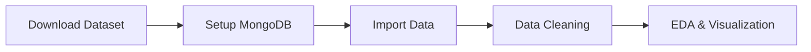
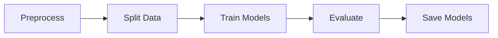
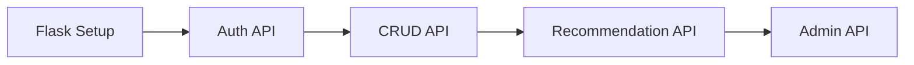
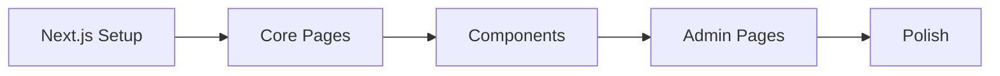

# 🎬 IMPLEMENTATION PLAN: ANIME RECOMMENDATION SYSTEM

## Kế hoạch triển khai tổng thể

---

## 📋 I. TỔNG QUAN DỰ ÁN

### Mục tiêu

Xây dựng hệ thống gợi ý Anime sử dụng Machine Learning, với giao diện web hiện đại.

### Tech Stack

| Layer        | Công nghệ                        |
| ------------ | -------------------------------- |
| **Frontend** | Next.js, TypeScript, TailwindCSS |
| **Backend**  | Python, Flask, Flask-CORS        |
| **Database** | MongoDB Local                    |
| **ML**       | Scikit-learn, Surprise, Scipy    |
| **Data**     | Kaggle Dataset (3M ratings)      |

### Kiến trúc tổng quan

```
┌─────────────────────────────────────────────────────────────────┐
│                         USER                                     │
└─────────────────────────┬───────────────────────────────────────┘
                          │
                          ▼
┌─────────────────────────────────────────────────────────────────┐
│                    FRONTEND (Next.js)                            │
│  ┌─────────┐ ┌─────────┐ ┌─────────┐ ┌─────────┐ ┌──────────┐  │
│  │  Home   │ │  Anime  │ │ Search  │ │ History │ │  Admin   │  │
│  └─────────┘ └─────────┘ └─────────┘ └─────────┘ └──────────┘  │
└─────────────────────────┬───────────────────────────────────────┘
                          │ REST API
                          ▼
┌─────────────────────────────────────────────────────────────────┐
│                     BACKEND (Flask)                              │
│  ┌─────────┐ ┌─────────┐ ┌─────────┐ ┌─────────────────────┐   │
│  │  Auth   │ │  Anime  │ │ Rating  │ │   Recommendation    │   │
│  └─────────┘ └─────────┘ └─────────┘ └─────────────────────┘   │
└─────────────────────────┬───────────────────────────────────────┘
                          │
          ┌───────────────┼───────────────┐
          ▼               ▼               ▼
┌─────────────────┐ ┌───────────┐ ┌─────────────────┐
│    MongoDB      │ │ ML Models │ │  Saved Models   │
│ (users, animes, │ │ (CF, CB)  │ │   (.pkl files)  │
│ ratings, history)│ └───────────┘ └─────────────────┘
└─────────────────┘
```

---

## 📊 II. DATASET

### Nguồn dữ liệu

-   **Kaggle**: `hernan4444/anime-recommendation-database-2020`

### Files sử dụng

| File                      | Mô tả               | Giới hạn        |
| ------------------------- | ------------------- | --------------- |
| `anime_with_synopsis.csv` | Thông tin anime     | Toàn bộ (~17K)  |
| `rating_complete.csv`     | Đánh giá người dùng | **3 triệu mẫu** |

### Thang điểm Rating

> ⚠️ **QUAN TRỌNG**: Dataset sử dụng thang điểm **1-10** (số nguyên)

---

## 🎯 III. USE CASES

### Người dùng thường

| UC  | Chức năng      | Mô tả                                       |
| --- | -------------- | ------------------------------------------- |
| UC1 | 🔐 Đăng nhập   | Đăng nhập bằng `user_id`, không mật khẩu    |
| UC2 | 📖 Xem anime   | Xem thông tin: tên, synopsis, genres, score |
| UC3 | 🎬 Nhận gợi ý  | Dựa trên mô hình ML đang active             |
| UC4 | ⭐ Đánh giá    | Rating anime từ 1-10                        |
| UC5 | 📜 Xem lịch sử | Lịch sử xem của bản thân và user khác       |
| UC6 | 🔍 Tìm kiếm    | Tìm anime theo tên                          |

### Admin

| UC   | Chức năng     | Mô tả                                   |
| ---- | ------------- | --------------------------------------- |
| UC7  | 📊 Dashboard  | Xem thống kê và visualization real-time |
| UC8  | 🎛️ Chọn model | Lựa chọn model recommendation active    |
| UC9  | 🔄 Train lại  | Huấn luyện lại model                    |
| UC10 | 📈 So sánh    | So sánh metrics giữa các models         |

---

## 🤖 IV. MACHINE LEARNING MODELS

### Models triển khai

| Model             | Mô tả                                      | Chia dữ liệu    |
| ----------------- | ------------------------------------------ | --------------- |
| **User-based CF** | Gợi ý dựa trên users tương tự              | Theo `user_id`  |
| **Item-based CF** | Gợi ý dựa trên anime tương tự              | Theo `anime_id` |
| **Content-based** | Gợi ý dựa trên nội dung (genres, synopsis) | Theo `genres`   |

### Metrics đánh giá

| Metric          | Công thức                           | Mục đích         |
| --------------- | ----------------------------------- | ---------------- |
| **RMSE**        | √(Σ(actual - predicted)²/n)         | Đo lỗi dự đoán   |
| **MAE**         | Σ\|actual - predicted\|/n           | Đo lỗi tuyệt đối |
| **Precision@K** | (relevant ∩ recommended) / K        | Độ chính xác     |
| **Recall@K**    | (relevant ∩ recommended) / relevant | Độ phủ           |

### Xử lý dữ liệu

-   ✅ Chuyển thành **ma trận thưa (Sparse Matrix)**
-   ✅ Chia train/test: **80:20**
-   ✅ Tránh **domain shift** bằng cách chia theo đúng entity

---

## 📁 V. CẤU TRÚC DỰ ÁN

```
Recommendation_system/
├── 📁 backend/                      # Python Flask API
│   ├── app/
│   │   ├── routes/                  # API endpoints
│   │   ├── services/                # Business logic
│   │   └── models/                  # DB models
│   ├── ml/
│   │   ├── models/                  # ML implementations
│   │   ├── training/                # Train scripts
│   │   └── saved_models/            # Trained models (.pkl)
│   ├── data/
│   │   ├── raw/                     # Kaggle data
│   │   └── processed/               # Cleaned data
│   ├── requirements.txt
│   └── run.py
│
├── 📁 frontend/                     # Next.js Application
│   ├── src/
│   │   ├── app/                     # Pages (App Router)
│   │   ├── components/              # React components
│   │   ├── hooks/                   # Custom hooks
│   │   ├── lib/                     # Utilities
│   │   └── types/                   # TypeScript types
│   ├── package.json
│   └── next.config.js
│
├── 📁 notebooks/                    # Jupyter notebooks (EDA)
├── 📄 require.md                    # Yêu cầu dự án
├── 📄 implementation_plan.md        # File này
├── 📄 implementation_plan_backend.md
└── 📄 implementation_plan_frontend.md
```

---

## 🚀 VI. PHASES TRIỂN KHAI

### Phase 1: Setup & Data Preparation (3-4 ngày)



**Tasks:**

-   [ ] Setup môi trường Python + Node.js
-   [ ] Cấu hình MongoDB Local
-   [ ] Download dataset từ Kaggle
-   [ ] Import dữ liệu vào MongoDB
-   [ ] Làm sạch dữ liệu (missing values, duplicates, outliers)
-   [ ] EDA + visualization cơ bản

---

### Phase 2: Machine Learning (4-5 ngày)



**Tasks:**

-   [ ] Vector hóa (TF-IDF, BOW, Embeddings)
-   [ ] Tạo Sparse Matrix
-   [ ] Chia train/test 80:20
-   [ ] Implement User-based CF
-   [ ] Implement Item-based CF
-   [ ] Implement Content-based
-   [ ] Đánh giá với RMSE, MAE, Precision@K, Recall@K
-   [ ] Lưu models (.pkl)

---

### Phase 3: Backend Development (5-6 ngày)



**Tasks:**

-   [ ] Khởi tạo Flask project
-   [ ] Cấu hình MongoDB connection
-   [ ] Auth endpoints (login, logout)
-   [ ] Anime endpoints (list, detail, search)
-   [ ] Rating endpoints (CRUD, thang 1-10)
-   [ ] History endpoints
-   [ ] Recommendation endpoints
-   [ ] Admin endpoints (stats, visualization, model management)

---

### Phase 4: Frontend Development (5-6 ngày)



**Tasks:**

-   [ ] Khởi tạo Next.js + TypeScript
-   [ ] Setup TailwindCSS
-   [ ] Trang đăng nhập
-   [ ] Trang chủ + gợi ý
-   [ ] Danh sách & chi tiết anime
-   [ ] Tìm kiếm
-   [ ] Lịch sử xem
-   [ ] Rating component (10 sao ⭐)
-   [ ] Admin dashboard
-   [ ] Admin - quản lý models
-   [ ] Admin - visualization charts

---

### Phase 5: Integration & Testing (2-3 ngày)

**Tasks:**

-   [ ] Tích hợp Frontend ↔ Backend
-   [ ] Test các API endpoints
-   [ ] Test recommendations accuracy
-   [ ] Test UI/UX
-   [ ] Fix bugs
-   [ ] Optimize performance

---

### Phase 6: Documentation & Deployment (1-2 ngày)

**Tasks:**

-   [ ] Viết README.md
-   [ ] API documentation
-   [ ] User guide
-   [ ] Deployment guide (optional)

---

## ⏱️ VII. TIMELINE TỔNG QUAN

```
┌────────────────────────────────────────────────────────────────┐
│  WEEK 1                                                        │
│  ├── Day 1-2: Setup & Download data                           │
│  ├── Day 3-4: Data cleaning & EDA                             │
│  └── Day 5-7: ML Models development                           │
├────────────────────────────────────────────────────────────────┤
│  WEEK 2                                                        │
│  ├── Day 8-10: Backend API development                        │
│  ├── Day 11-13: Frontend development                          │
│  └── Day 14: Admin features                                   │
├────────────────────────────────────────────────────────────────┤
│  WEEK 3                                                        │
│  ├── Day 15-16: Integration & Testing                         │
│  └── Day 17-18: Documentation & Final polish                  │
└────────────────────────────────────────────────────────────────┘

Tổng thời gian ước tính: 2.5 - 3 tuần
```

---

## ✅ VIII. CHECKLIST TỔNG HỢP

### Data & ML

-   [ ] Download dataset từ Kaggle
-   [ ] Setup MongoDB & import data
-   [ ] Làm sạch dữ liệu
-   [ ] EDA & visualization
-   [ ] Implement 3 ML models
-   [ ] Đánh giá và so sánh models

### Backend

-   [ ] Setup Flask project
-   [ ] Authentication API
-   [ ] Anime CRUD API
-   [ ] Rating API (thang 1-10)
-   [ ] History API
-   [ ] Recommendation API
-   [ ] Admin API

### Frontend

-   [ ] Setup Next.js project
-   [ ] Core pages (Home, Login, Anime, Search, History)
-   [ ] Components (AnimeCard, RatingStars, RecommendationList)
-   [ ] Admin pages (Dashboard, Models, Visualization)
-   [ ] Responsive design

### Integration

-   [ ] API integration
-   [ ] Testing
-   [ ] Bug fixes
-   [ ] Documentation

---

## 📚 IX. TÀI LIỆU LIÊN QUAN

| File                                                                 | Mô tả                      |
| -------------------------------------------------------------------- | -------------------------- |
| [require.md](./require.md)                                           | Yêu cầu chi tiết dự án     |
| [implementation_plan_backend.md](./implementation_plan_backend.md)   | Plan chi tiết cho Backend  |
| [implementation_plan_frontend.md](./implementation_plan_frontend.md) | Plan chi tiết cho Frontend |

---

## 🎯 X. TIÊU CHÍ HOÀN THÀNH

| #   | Tiêu chí         | Mô tả                               |
| --- | ---------------- | ----------------------------------- |
| 1   | ✅ Dataset       | ≥ 2,000 items, ≥ 5 features         |
| 2   | ✅ Data cleaning | Missing, duplicates, outliers xử lý |
| 3   | ✅ Visualization | Charts: histogram, bar, heatmap     |
| 4   | ✅ ML Models     | 3 models hoạt động                  |
| 5   | ✅ Evaluation    | RMSE, MAE, Precision@K, Recall@K    |
| 6   | ✅ Web Interface | Đầy đủ chức năng theo use cases     |
| 7   | ✅ Real-time     | Gợi ý theo thời gian thực           |
| 8   | ✅ Admin         | Dashboard, model management         |
