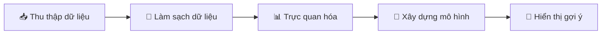

# 🎬 FINAL PROJECT: XÂY DỰNG HỆ THỐNG GỢI Ý ANIME

## Anime Recommendation System

---

## 📋 I. MÔ TẢ BÀI TOÁN

Xây dựng một **hệ thống gợi ý phim Anime** sử dụng các kỹ thuật Machine Learning.

### 📦 Nguồn Dữ Liệu

```python
import kagglehub

# Download latest version
path = kagglehub.dataset_download("hernan4444/anime-recommendation-database-2020")
print("Path to dataset files:", path)
```

### 📊 Cấu Trúc Dữ Liệu

| File                      | Mô tả                   | Giới hạn        |
| ------------------------- | ----------------------- | --------------- |
| `anime_with_synopsis.csv` | Thông tin anime         | Toàn bộ         |
| `rating_complete.csv`     | Đánh giá của người dùng | **3 triệu mẫu** |

#### Chi tiết các cột:

| **anime_with_synopsis.csv**   | **rating_complete.csv**   |
| ----------------------------- | ------------------------- |
| `MAL_ID` - ID anime           | `user_id` - ID người dùng |
| `Name` - Tên anime            | `anime_id` - ID anime     |
| `Score` - Điểm đánh giá       | `rating` - Điểm đánh giá  |
| `Genres` - Thể loại           |                           |
| `synopsis` - Tóm tắt nội dung |                           |

---

## 💾 II. LƯU TRỮ & XỬ LÝ DỮ LIỆU

### Database

-   **MongoDB Local** để lưu trữ:
    -   2 bảng dữ liệu gốc
    -   Dữ liệu thu thập từ người dùng (rating, lịch sử xem phim, ...)

### Tối ưu hóa

> ⚡ Chuyển đổi dữ liệu thành **ma trận thưa (Sparse Matrix)** để xử lý hiệu quả

### Chia dữ liệu Train/Test (80:20)

- Chia dữ liệu để đảm bảo không bị domain shift

---

## 🏗️ III. KIẾN TRÚC HỆ THỐNG

```
┌─────────────────────────────────────────────────────────┐
│                    FRONTEND                             │
│            Next.js + TypeScript                         │
└─────────────────────┬───────────────────────────────────┘
                      │ API Calls
                      ▼
┌─────────────────────────────────────────────────────────┐
│                    BACKEND                              │
│              Python + Flask                             │
└─────────────────────┬───────────────────────────────────┘
                      │
                      ▼
┌─────────────────────────────────────────────────────────┐
│                   DATABASE                              │
│                MongoDB Local                            │
└─────────────────────────────────────────────────────────┘
```

---

## 🎯 IV. CÁC USE CASES

### 👤 Người dùng thường

| #   | Chức năng                  | Mô tả                                                          |
| --- | -------------------------- | -------------------------------------------------------------- |
| 1   | 🔐 **Đăng nhập/Đăng xuất** | Đăng nhập bằng `user_id`, không cần mật khẩu, không có đăng ký |
| 2   | 📖 **Xem thông tin phim**  | Hiển thị: Tên, Synopsis, Genres, Score                         |
| 3   | 🎬 **Nhận gợi ý phim**     | Dựa trên mô hình recommendation đã huấn luyện                  |
| 4   | 📜 **Xem lịch sử**         | Lịch sử xem phim của bản thân và người dùng khác               |
| 5   | 🔍 **Tìm kiếm phim**       | Tìm theo tên phim                                              |

### 👑 Admin

| #   | Chức năng             | Mô tả                              |
| --- | --------------------- | ---------------------------------- |
| 1   | 🎛️ **Chọn mô hình**   | Lựa chọn mô hình recommendation    |
| 2   | 📊 **Visualization**  | Xem dữ liệu real-time              |
| 3   | 🔄 **Huấn luyện lại** | Train lại mô hình recommendation   |
| 4   | 📈 **So sánh models** | Xem và so sánh hiệu suất các model |

---

## ⚙️ V. KHẢ NĂNG HỆ THỐNG



---

## 📝 VI. YÊU CẦU CHI TIẾT

### 1️⃣ Thu thập dữ liệu

| Yêu cầu        | Chi tiết                    |
| -------------- | --------------------------- |
| Số lượng items | ≥ **2,000** items           |
| Features       | ≥ **5** features mô tả item |

---

### 2️⃣ Làm sạch & Chuẩn bị dữ liệu

-   [ ] Xử lý **Missing values**
-   [ ] **Chuẩn hóa** dữ liệu
-   [ ] Loại bỏ **Duplicate**
-   [ ] Xử lý **Outlier**
-   [ ] **Vector hóa**: TF-IDF, BOW, Embeddings

---

### 3️⃣ Phân tích & Trực quan hóa

| Loại biểu đồ | Nội dung               |
| ------------ | ---------------------- |
| 📊 Histogram | Phân bố rating         |
| 📊 Bar Chart | Tần suất nhóm sản phẩm |
| 📊 Bar Chart | Top items              |
| 🗺️ Heatmap   | Tương quan dữ liệu     |

---

### 4️⃣ Xây dựng Hệ Gợi Ý

| Tính năng     | Mô tả                                    |
| ------------- | ---------------------------------------- |
| 🤖 Models     | Sử dụng models từ slide hoặc nguồn ngoài |
| 🧠 Embeddings | Sử dụng embeddings nâng cao              |
| ⚡ Real-time  | Gợi ý theo thời gian thực                |
| 💾 Lịch sử    | Lưu lịch sử người dùng                   |

---

### 5️⃣ Đánh giá Mô hình

| Metric          | Mô tả                  |
| --------------- | ---------------------- |
| **RMSE**        | Root Mean Square Error |
| **MAE**         | Mean Absolute Error    |
| **Precision@K** | Độ chính xác tại K     |
| **Recall@K**    | Độ phủ tại K           |

---

### 6️⃣ Giao diện

> 🌐 **Web Interface** được xây dựng với Flask (Backend) và Next.js (Frontend)

---

## ✅ CHECKLIST TỔNG QUAN

-   [ ] 📥 Thu thập dữ liệu từ Kaggle
-   [ ] 🧹 Làm sạch và xử lý dữ liệu
-   [ ] 💾 Upload dữ liệu lên MongoDB
-   [ ] 📊 Trực quan hóa dữ liệu
-   [ ] 🤖 Xây dựng các mô hình (User-based, Item-based, Content-based)
-   [ ] 📈 Đánh giá và so sánh mô hình
-   [ ] 🔧 Phát triển Backend (Flask)
-   [ ] 🎨 Phát triển Frontend (Next.js)
-   [ ] 🔗 Tích hợp hệ thống
-   [ ] 🧪 Testing và tối ưu
